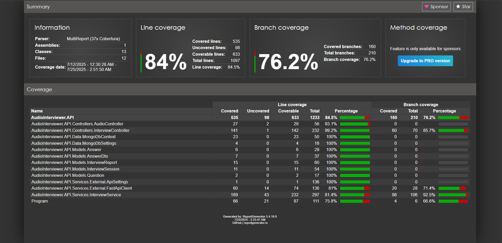

# AudioInterviewer Backend 

## 1. Project Overview

**AudioInterviewer Backend** is a C#/.NET 8 Web API for conducting AI-powered, audio-based technical interviews.  
Key features:

- Exposes RESTful endpoints for initializing sessions, handling question/answer flow, audio uploads (using MongoDB GridFS), and providing final interview reports.
- Integrates with an external LLM microservice (via FastAPI) for dynamic question generation and candidate evaluation.
- Uses MongoDB (document and GridFS) for persistent storage.
- Containerized via Docker Compose for seamless development and deployment.
- Provides a suite of unit, integration, and load tests for reliability and scalability.

## 2. System Architecture

**Core Components:**

| Component         | Technology                        | Role & Responsibilities                                |
|-------------------|-----------------------------------|--------------------------------------------------------|
| Backend API       | C#/.NET 8 Web API                 | Exposes all endpoints, drives the interview workflow   |
| Database          | MongoDB  with GridFS            | Stores sessions, reports; GridFS for audio files       |
| LLM Microservice  | FastAPI (Python, external/mocked) | Provides dynamic questions and evaluation              |
| Load Testing      | k6 (JavaScript)                   | Simulates concurrent user loads                        |
| Containerization  | Docker, Docker Compose            | Orchestrates backend and DB in dev/production          |

**High-Level Data Flow:**

- User initializes a session and answers questions via audio.
- Each answer is stored as a base64-encoded audio blob streamed into GridFS; metadata and transcripts reside with the session.
- After all questions are answered, the backend queries the LLM service for candidate evaluation and generates a report.

## 3. API Reference

## API Endpoint 

### 1. Interview Initialization

**Endpoint:**  
`POST /api/interview/init`

**Purpose:**  
Initialize a new interview session with user email and job description. Returns a unique session ID and the first AI-generated question.

**Request Body (JSON):**
- `email` **(required)**: Candidate’s email address. Must be valid (checked by data annotations).
- `jobDescription` **(required, min 10 chars)**: Position or role; forms prompt context for the LLM.

**Response:**  
```json
{
  "message": "Interview initialized",
  "sessionId": "",
  "firstQuestion": ""
}
```

**Errors:**  
- 400 BadRequest if missing or invalid fields.

### 2. Get Next Interview Question

**Endpoint:**  
`GET /api/interview/question?sessionId=...`

**Purpose:**  
Fetch the current or next question in an ongoing interview session.

**Query Parameters:**
- `sessionId` **(required)**: The ID from initialization.

**Response:**  
- If new question:  
  ```json
  {
    "index": ,
    "question": ""
  }
  ```
- If all questions are complete:  
  ```json
  { "message": "Interview complete" }
  ```

**Errors:**  
- 400 BadRequest if sessionId is missing.

### 3. Submit an Answer

**Endpoint:**  
`POST /api/interview/answer`

**Purpose:**  
Record an answer for the current question, including audio and transcript.

**Request Body (JSON):**
- `sessionId` **(required)**: ID of the ongoing interview session.
- `question` **(required, min 10 chars)**: The question being answered (cross-checked for session validity).
- `audioBase64` **(required, min 5000 chars)**: Base64-encoded audio, required for GridFS storage.
- `transcript` *(optional, max 5000 chars)*: Transcript of the spoken answer.

**Response:**
```json
{
  "message": "Answer recorded",
  "index": 
}
```

**Errors:**  
- 400 BadRequest if payload is missing/invalid, audio too short, or session not found.

### 4. Complete Interview

**Endpoint:**  
`POST /api/interview/complete?sessionId=...`

**Purpose:**  
Mark the session as finished; returns a summary (totals of questions/answers).

**Query Parameters:**
- `sessionId` **(required)**

**Response:**
```json
{
  "message": "Interview completed",
  "totalQuestions": ,
  "totalAnswers": 
}
```

**Errors:**
- 400 BadRequest if sessionId missing or invalid.

### 5. Generate/Fetch AI Report

**Endpoint:**  
`GET /api/interview/report?sessionId=...`

**Purpose:**  
Generate (and persist) the AI evaluation report for a completed interview; fetches if already created.

**Query Parameters:**
- `sessionId` **(required)**

**Response:**  
A detailed JSON object, shape:
```json
{
  "jd": "",
  "score": ,
  "questions": [ "...", ... ],
  "answers": [
    { "question": "...", "transcript": "...", "audio": "/api/audio/" }
  ],
  "strengths": [ "..." ],
  "improvements": [ "..." ],
  "followUps": [ "..." ]
}
```

**Errors:**  
- 400 BadRequest if sessionId missing or invalid.

### 6. List All Reports by Email

**Endpoint:**  
`GET /api/interview/reports?email=...`

**Purpose:**  
List all reports generated for a specific candidate email.

**Query Parameters:**
- `email` **(required)**

**Response:**  
An array of report objects (see InterviewReport model).

**Errors:**  
- 400 BadRequest if email missing or invalid.

### 7. Fetch Report by ID

**Endpoint:**  
`GET /api/interview/report/{id}`

**Purpose:**  
Retrieve a single report by its unique MongoDB ObjectId.

**Route Parameter:**
- `id` **(required)**: MongoDB report ObjectId string.

**Response:**  
A single report object as JSON.

**Errors:**  
- 400 BadRequest if ID is missing.
- 404 NotFound if report not found.

### 8. Fetch Audio File

**Endpoint:**  
`GET /api/audio/{id}`

**Purpose:**  
Stream a single answer's audio file (in `.webm` format) by its GridFS ObjectId.

**Route Parameter:**
- `id` **(required)**: ObjectId string for the file in GridFS.

**Response:**  
- HTTP 200 OK, `Content-Type: audio/webm`: Binary stream of the audio answer.

**Errors:**  
- 404 if not found.
- 500 InternalServerError on database access error.

### 9. Health Check

**Endpoint:**  
`GET /api/interview/health`

**Purpose:**  
Basic operational check for backend and database.

**Response:**  
- 200 OK, body is: `"Healthy"`

## Notes on Validation, Errors, and Conventions

- All inputs are validated via data annotations and, for audio files, by server-side checks.
- Missing/invalid parameters yield precise error messages with `400 BadRequest`.
- For audio download, missing files return `404 Not Found`.
- Health endpoint is always available for monitoring.

**Notes on API:**

- All validation errors result in `400 BadRequest` with detailed info.
- All endpoints return JSON except for `/api/audio/{id}` (binary `audio/webm`).
- Only 5 questions per session are permitted by default.

## 4. Data Models

**4.1. InterviewSession**

- Fields: `Id`, `Email`, `JobDescription`, `Questions[]`, `Answers[]`, `CurrentIndex`
- Each `Answer` includes: `Question`, `AudioUrl` (to `/api/audio/{id}`), `Transcript`

**4.2. InterviewReport**

- Fields: `Id`, `Email`, `JobDescription`, `CandidateFitScore`, `Strengths[]`, `ImprovementAreas[]`, `SuggestedFollowUp[]`, `Answers[]`

**4.3. Audio Storage**

- Audio files are uploaded as base64 and decoded on the backend.
- Stored in MongoDB GridFS (`audioFiles` bucket) as `.webm`.
- Accessed using `/api/audio/{ObjectId}` endpoint.

## 5. Environment Setup

### 5.1. Local Development

**Prerequisites:**
- .NET 8 SDK
- MongoDB 
- Node.js (for k6)
- Python 3.8+ (for FastAPI LLM, only for load tests)

**Steps:**

1. Clone repo:
   ```sh
   git clone 
   cd AudioInterviewer-Backend
   ```

2. Configure `appsettings.Development.json`:
   ```json
   {
       "MongoDB": { "ConnectionString": "mongodb://localhost:27017", "DatabaseName": "AudioInterviewDb" },
       "FastApiClient": { "BaseUrl": "http://localhost:8000/api" }
   }
   ```

3. Start MongoDB (if not Docker):
   ```sh
   mongod --dbpath ./data/mongo
   ```

4. Run backend:
   ```sh
   dotnet restore
   dotnet build
   dotnet run --project AudioInterviewer.API
   ```

5. Access Swagger UI (API docs):
   - [http://localhost:5035/swagger](http://localhost:5035/swagger)

### 5.2. Dockerized Setup

- Start full stack (API + MongoDB):
  ```sh
  docker compose up --build
  ```
- Edit environment variables in `docker-compose.yml` for custom setup.

### 5.3. Mock LLM for Load Testing Only

- Default LLM endpoint is your production or dev FastAPI LLM.
- **When running k6 load tests**, start the mock LLM (`mock_llm.py`):
  ```sh
  venv\Scripts\activate   
  uvicorn mock_llm:app --host 0.0.0.0 --port 8001
  ```
- Set backend/config to use the mock (`FastApiClient__BaseUrl="http://localhost:8001"`), or set `LLM_BASE` in your loadtest script.
- **Mock LLM should only run during load testing**, not in regular use[23][22].

## 6. Testing

### 6.1. Unit Tests

**Framework:** xUnit (see `/AudioInterviewer.Tests/`)

- **Model validation:** Tests confirm required fields, data annotations, length/format limits for all DTOs and core models[19].
- **Controllers:** Tests verify all endpoints return correct data/shapes and handle error paths correctly[17][16].
- **Service layer:** Verifies session logic, question/answer flow, audio storage, exception paths[20].

**Run all tests:**
```sh
dotnet test
```

### 6.2. Integration Testing

- Uses mock services to test the full HTTP request → response pipeline.
- Sample session flows include: session init, next question, submit answer, complete, generate/fetch report, get audio[25].

### 6.3. Load Testing

- **Tool:** k6, script at `loadtest.js`
- **Scenario:** Ramp up to 100 concurrent "users," each running a full interview session (init, Q&A, complete)[22].
- **Mock LLM and loadtest endpoints:** 
  - Mock LLM at `/v1/chat/completions` provides canned responses for reproducibility.
  - k6 script simulates user think time (`sleep(1-2)`) between answers.
- **Run:**
  ```sh
  # Start backend + mock_llm.py, ensure backend uses mock as LLM endpoint
  k6 run loadtest.js
  ```
- **Thresholds:** 95% requests <5s, failure rate <1%.

### 6.4 Coverage Report

- **Run:-**  dotnet test /p:CollectCoverage=true /p:CoverletOutput=coverage.xml /p:CoverletOutputFormat=cobertura
         and
         # Open coverage-html/index.html in a browser

Coverage report :- 


## 7. Storage Details

- **MongoDB Collections:**
  - `InterviewSessions`: Stores per-user state and progress.
  - `InterviewReports`: Stores AI-generated candidate reports.
- **GridFS (`audioFiles`):**
  - Binary `.webm` chunks (255KB chunk size) with `WriteConcern.WMajority`
  - Audio references stored in `Answers` list by URL (`/api/audio/{id}`).

## 8. Health Checks

- Endpoint `/api/interview/health` (GET): returns `"Healthy"` when backend and MongoDB are operational.

## 9. Test and Validation Matrix

| Layer           | What’s Tested                                      | Example Test Methods                                   |
|-----------------|----------------------------------------------------|--------------------------------------------------------|
| Models/DTOs     | Data annotations, field presence & format          | Required fields, min/max length, URL, email validation |
| Controllers     | Each endpoint input/output, error handling         | Valid/invalid requests, JSON payloads, status codes    |
| Services        | Session and Q&A logic, audio handling, LLM fallback| Insert, update, retrieval, exception scenarios         |
| Integration/API | End-to-end per endpoint & session flow             | Start→finish interview; audio upload/retrieval         |
| Load            | Concurrency, throughput, error rates               | Full user simulations with k6 under heavy load         |

## 10. File/Directory Structure

```
backend-audio-interviewer/
├── .dockerignore
├── .git/
├── .github/
│   └── workflows/
│       ├── cd.yml
│       └── ci.yml
├── AudioInterviewer.API/
│   ├── AudioInterviewer.API.csproj
│   ├── AudioInterviewer.API.http
│   ├── Program.cs
│   ├── appsettings.json
│   ├── appsettings.Development.json
│   ├── Controllers/
│   │   ├── AudioController.cs
│   │   └── InterviewController.cs
│   ├── Data/
│   │   ├── IMongoDbContext.cs
│   │   ├── MongoDbContext.cs
│   │   └── MongoDbSettings.cs
│   ├── Models/
│   │   ├── Answer.cs
│   │   ├── AnswerDto.cs
│   │   ├── InterviewReport.cs
│   │   ├── InterviewSession.cs
│   │   └── Question.cs
│   ├── Services/
│   │   └── InterviewService.cs
│   ├── Services.External/
│   │   └── FastApiClient.cs
│   └── wwwroot/
│       └── audio/
├── AudioInterviewer.Tests/
│   ├── AudioInterviewer.Tests.csproj
│   ├── Controllers/
│   │   ├── AudioControllerTests.cs
│   │   └── InterviewControllerTests.cs
│   ├── Data/
│   │   └── DataTests.cs
│   ├── Helpers/
│   │   ├── FakeAsyncCursor.cs
│   │   ├── FakeFindFluent.cs
│   │   └── MongoMockHelpers.cs
│   ├── Models/
│   │   └── Model_test.cs
│   ├── Services/
│   │   └── External/  (mocks for external calls)
│   ├── IntegrationTest-2.cs
│   └── UnitTest1.cs
├── AudioInterviewer.sln
├── Dockerfile
├── docker-compose.yml
├── load‑testing/
│   └── loadtest.js
├── mock‑fastapi/
│   ├── mock_llm.py
│   ├── requirements.txt
│   └── venv/        (Python virtual environment for the mock service)
├── README.md
├── coverage‑report/  (generated HTML reports)
└── CoverageReport/   (alternate coverage artifacts)

```

